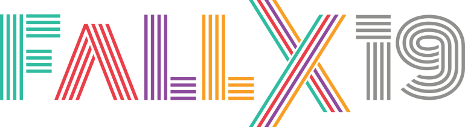
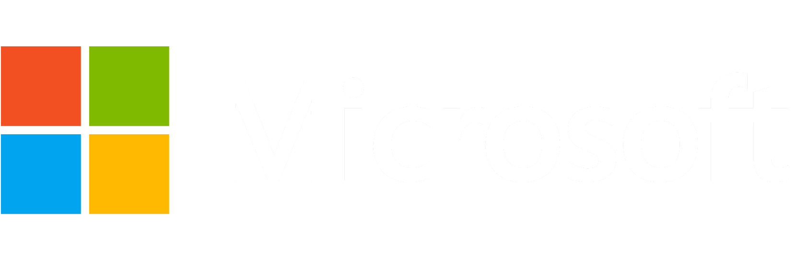

@snap[west span-100]
## @css[vs](Visual Studio 2019)
### @css[vs](Launch 🚀 Event)
@snapend

---?image=assets/white.png

@snap[logo-img fallx-logo span-100]
## @css[vs](Community Update 😎)
 
@css[ccc](@color[#ECD290](Cream) @color[#F15322](City) @color[#688B8B](Code) +)

  
https://fallexperiment.com/

@snapend

---

@snap[west span-100]
## @css[vs](Thank you 🙏)
### @css[vs](Sponsors & Supporters)
@snapend

---?image=assets/teals.png&position=right&size=45% 100%&color=rgb(68,114,196)

@snap[north-west logo-img ms-logo span-55]

### @color[cyan](TEALS) Program
 
@size[2.2rem](_Computer Science_ professionals @color[whitesmoke](+) _High School_ teachers working together to build and grow CS programs 👏)
  
@size[1.9rem](__Apply: &nbsp; @color[black](www.tealsk12.org)__) 
@size[1.9rem](__Mark Zachar, &nbsp; @color[black](markz@tealsk12.org)__)

@snapend

---?image=assets/microsoft-logo.png&size=auto 45%
---

---?image=https://oz-code.com/wp-content/uploads/2019/02/ozcode_logo_long.svg&size=auto 70%
---

---

@snap[west span-100]
# 😁 @css[vs](3x @color[red](@fa[award]))
@snapend

---?image=https://revdebug.com/wp-content/uploads/2018/10/RevDeBug-4k-transparent-logo-nomargin.png&size=auto 25%
---

---

@snap[west span-100]
# 😁 @css[vs](3x @color[red](@fa[award]))
@snapend

---?image=https://www.whitesourcesoftware.com/wp-content/uploads/2016/06/whitesource_logo_rgb-02.png&size=auto 33%
---

@snap[west span-70]
__WhiteSource__ is the leader in open source security and license compliance management. Our vision is to empower businesses to develop better software by harnessing the power of open source.
  
<a href='www.whitesourcesoftware.com' target='_blank'>www.whitesourcesoftware.com</a>
@snapend

---?image=assets/centare-logo.png&size=auto 28%
---

@snap[west span-70]

<h2>@css[vs](Careers) 🤘</h2>
 

@ul[square span-100](false)

 - Senior .NET Developer
 - Director of Business Development
 - Data Science Practice Lead
 - Front End Developer In Test
 - Java Developer

@ulend

  
<a href='www.centare.com' target='_blank'>www.centare.com</a>
@snapend

---?image=assets/white.png

### @css[vs](Agenda) 📋 ... (@size[3rem](take a 📸, it'll last longer))

| Time | Presenter | Details |
|--:|:--|:--|
| __8:30__ | Host | ☕ + 🥯 = Morning Registration |
| __9:00__ | Scott Addie | Building Real-time Web w/ ASP.NET Core SignalR |
| __10:00__ | David Pine | What's new in C# 8 |
| __11:00__ | Scott Addie | Protecting App Secrets w/ .NET Core & Azure |
| __🕛__ | -- | 🍕 + 🎂 = Lunch |
| __1:30__ | Lance Larsen | VS 2019 + Unity + Azure Spatial Anchors + Mixed Reality |
| __2:30__ | Carl Schweitzer | Enabling Edge Intelligence with Azure IoT |
| __3:30__ | Host | Raffle Licenses & Networking |

---

@snap[west span-100]
## @css[vs](Social Media @color[#1da1f2](@fa[twitter]))

@ul[no-bullets](false)

 - @color[#1da1f2](@Centare)
 - @color[#1da1f2](@VisualStudio)
 - @color[#1da1f2](#VS2019)
 - @color[#1da1f2](#DeveloperCommunity)

@ulend
@snapend